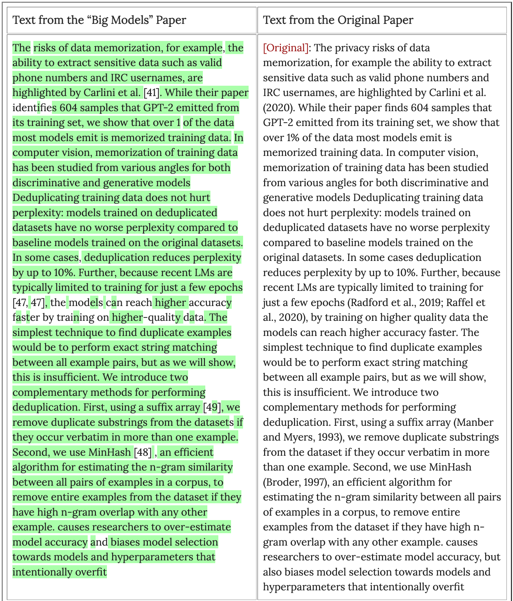
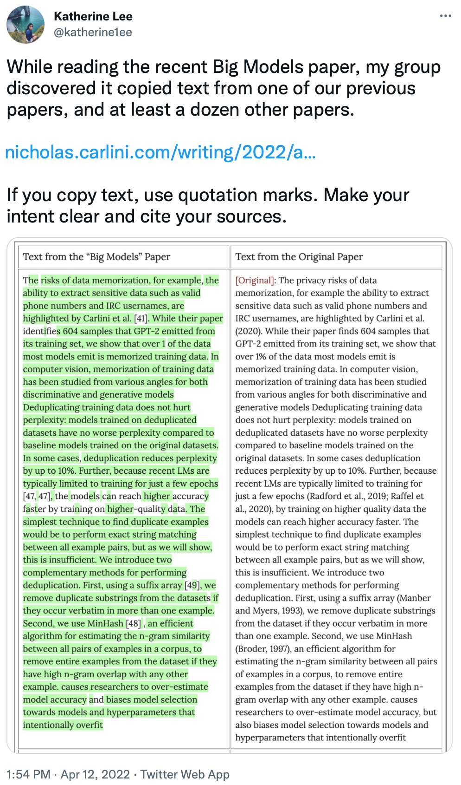
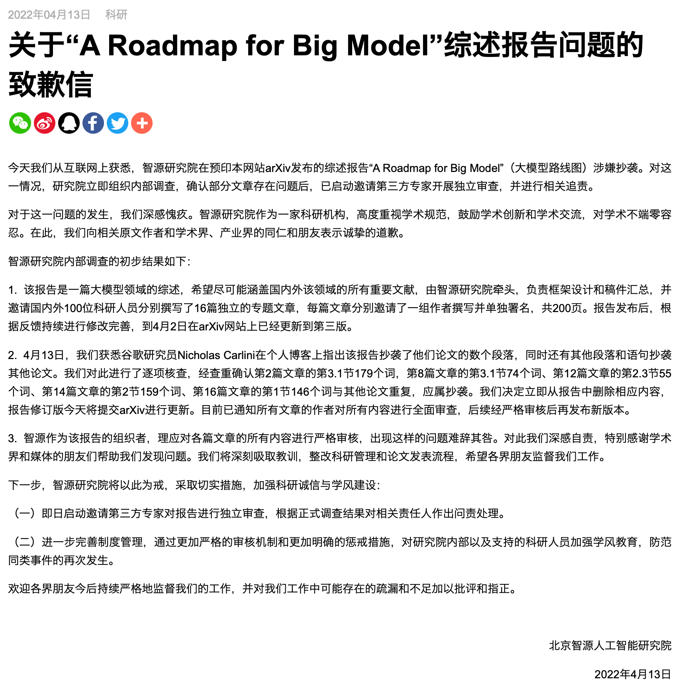

# 关于A Roadmap for Big Models部分篇章涉嫌抄袭的讨论

## 事件整理

### 缘起

2022年4月8日，Nicholas Carlini在个人主页发表了[一篇博客](https://nicholas.carlini.com/writing/2022/a-case-of-plagarism-in-machine-learning.html)，指出arXiv预印论文[A Roadmap for Big Model](https://arxiv.org/abs/2203.14101)中部分章节抄袭了他的论文[Deduplicating Training Data Makes Language Models Better](https://arxiv.org/abs/2107.06499)，并展示了抄袭部分的文字比较（见下图），同时他指出，A Roadmap for Big Model可能同时抄袭了十余篇其他论文。

[论文A Roadmap for Big Model (v1)](pdf/2203.14101v1.pdf)[1](#footnote1) [论文Deduplicating Training Data Makes Language Models Better (v2)](pdf/2107.06499.pdf) [Nicholas Carlini发表的博客](pdf/A-Case-of-Plagarism-in-Machine-Learning-Research.pdf)

### Twitter热议

2022年4月12日，被抄袭论文的一作Katherine Lee在[推特转发](https://twitter.com/katherine1ee/status/1513938735028654083?s=20&t=Xkr8jdNoK6FuePXPl593nA)了Nicholas Carlini的博客，并表示论文中复制文字应用引号注明，并明确的引用相关论文。该推特得到了广泛的关注，并在推特引起热议。截至目前已经获得1,333点赞以及212转发。

[截图1](figures/a-roadmap-for-big-model-05.png)

### 官方回应

次日(2022/04/13)，BAAI官方在[知乎](https://zhuanlan.zhihu.com/p/498064778)/[Twitter](https://twitter.com/BAAIBeijing/status/1514311359072288776?s=20&t=YR1SGxxGXQrBSBN2R5HslQ)/[官网](https://www.baai.ac.cn/portal/article/index/cid/4/id/404.html)发布了就此次事件的调查结果，BAAI声称邀请了“第三方专家”进行独立调查，承认了改论文部分章节存在的抄袭行为。官方及时正面回复此次事件的态度值得赞赏，但遗憾的是既没有披露抄袭事件更多的细节，也没有公布对于涉事人员任何的追责惩罚。

[截图1](figures/a-roadmap-for-big-model-00.png) [截图2](figures/a-roadmap-for-big-model-01.png) [截图3](figures/a-roadmap-for-big-model-02.png) [截图4](figures/a-roadmap-for-big-model-03.png)

<a name="footnote1">1</a>: 被广泛用作的抄袭调查的A Roadmap for Big Model (v2)已被从arXiv删除。
